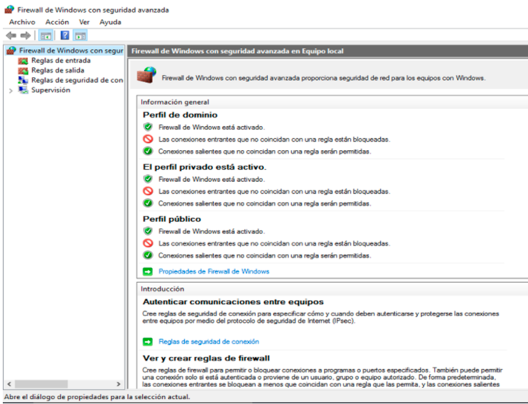
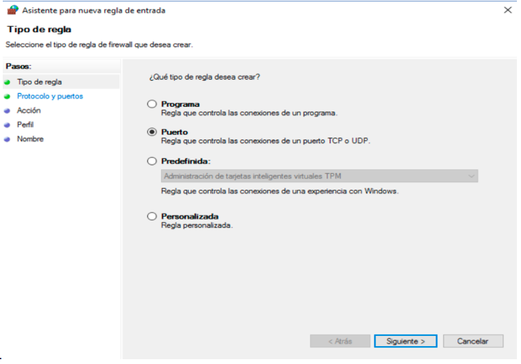

## Configuración de Redirección de Puertos

Este archivo explica cómo configurar la redirección de puertos en Windows y cómo realizar los ajustes necesarios en el router para garantizar que las conexiones externas lleguen correctamente al equipo de destino.

#### **Requisitos previos**
- Permisos de administrador en tu sistema Windows.
- Acceso al panel de administración del router (generalmente vía navegador web).

---

### **Pasos para Configurar la Redirección de Puertos**

### **En Windows**

#### **1. Acceder al Firewall de Windows con Seguridad Avanzada**
1. Presiona `Win + S` para abrir el buscador de Windows.
2. Escribe `Firewall de Windows con seguridad avanzada` y selecciona la opción.
3. En la ventana principal, verás el árbol de configuración.
 

#### **2. Crear 2 Nuevas Reglas de Entrada**
1. Haz clic en **Reglas de entrada** en el panel izquierdo.
2. Selecciona **Nueva regla** en el panel derecho.
3. En el asistente, elige **Puerto** y haz clic en **Siguiente**.

 

5. **Especifica el puerto:**
   - Selecciona primero **TCP**
    Introduce el puerto `25565`.
6. Selecciona **Permitir la conexión** y haz clic en **Siguiente**.
7. Marca los perfiles de red que se aplicarán (**Dominio**, **Privada**, **Pública**) y haz clic en **Siguiente**.
8. Asigna un nombre a la regla (por ejemplo, `Redirección puerto Java`) y haz clic en **Finalizar**.
9. Repite este mismo proceso pero con el puerto `19132` y **UDP**.

#### **3. Configurar la Regla para Redirigir al Destino**
1. Encuentra la regla que creaste en **Reglas de entrada**.
2. Haz clic derecho sobre la regla y selecciona **Propiedades**.
3. En la pestaña **Acción**, configura:
   - **Redirigir a la IP local**: Asegúrate de que la IP de destino sea la del equipo (puedes obtenerla con el comando `ipconfig` en la terminal).
   - **Puerto de destino**: Introduce el puerto que recibirás.
4. Haz clic en **Aceptar**.

#### **4. Crear una Regla de Salida (si es necesario)**
1. En el panel izquierdo, selecciona **Reglas de salida**.
2. Repite los pasos de la sección **2. Crear una Nueva Regla de Entrada**, ajustando según sea necesario.

---

### **En el Router**

> **Nota:** Si no ves las opciones en vuestra configuración del router [aquí](/port-redirect) tienes fotos con las configuraciones más habituales.

#### **1. Accede al Panel de Administración del Router**
1. Abre un navegador web.
2. Ingresa la dirección IP del router en la barra de direcciones de tu navegador (normalmente es `192.168.1.1` o `192.168.0.1`).
3. Introduce el nombre de usuario y la contraseña (revisa en la etiqueta del router o consulta al proveedor si no los conoces).

#### **2. Localiza la Configuración de Redirección de Puertos**
1. Busca una sección como **NAT**, **Port Forwarding**, **Virtual Server**, o algo similar (la ubicación puede variar según el modelo del router).
2. Haz clic para acceder a la configuración.

#### **3. Configura la Regla de Redirección**
1. **Añade una nueva regla de redirección:**
   - **Nombre o Descripción**: Introduce un nombre descriptivo (por ejemplo, `Minecraft Java/Bedrock`).
   - **Protocolo**: Selecciona **TCP** o **UDP**.
   - **Puerto externo**: Especifica el puerto que recibirá las conexiones externas (`25565` si pusiste **TCP** `19132` si fue **UDP**).
   - **IP del dispositivo local**: Introduce la IP local de tu equipo (por ejemplo, `192.168.1.100`).
   - **Puerto interno**: Especifica el puerto al que deseas redirigir en el dispositivo local (generalmente es el mismo que el puerto externo).
2. Guarda los cambios y repite con el protocolo que falta y su puerto

#### **4. Activa la Configuración**
1. Busca un botón o una opción para aplicar o guardar la configuración (puede estar etiquetado como **Guardar**, **Apply**, o similar).
2. Reinicia el router si es necesario para que los cambios surtan efecto. (No suele ser necesario)

---

### **Probar la Configuración**
Desde una conexión externa (como datos móviles), utiliza una herramienta como [Port Checker](https://www.yougetsignal.com/tools/open-ports/) o las herramientas del archivo [README](/README.md) para verificar si el puerto está abierto.
